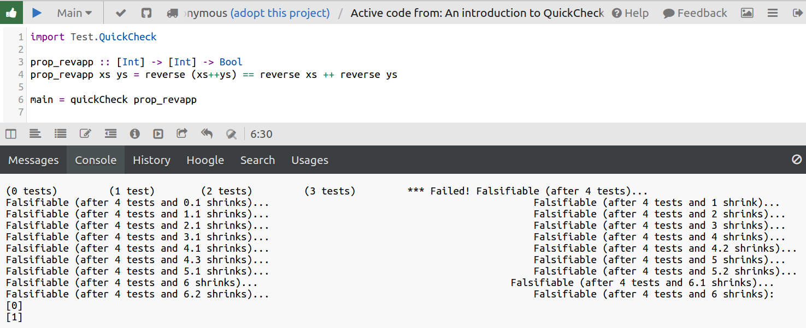

# QuickCheck

<!-- https://www.fpcomplete.com/user/pbv/an-introduction-to-quickcheck-testing -->
- Haskell
- From 1999
- Property based testing

Note: property based testing
- you specify a property of your code that must hold
- QuickCheck will "Quickly Check" if it can prove you wrong
- framework does its best to find a counterexample

### QuickCheck quick example

    import Test.QuickCheck

    prop_revapp :: [Int] -> [Int] -> Bool
    prop_revapp xs ys = reverse (xs++ys) == reverse xs ++ reverse ys

    main = quickCheck prop_revapp

Note: - 4 integers / fingers
- arms snap off?
- this isn't PyHaskellConUK, so let's not accidentally learn Haskell!

Instead...

Let's hear what functional language developers think of our world

([from *learn you a haskell*](http://learnyouahaskell.com/input-and-output))

Note: *In an imperative language, you have no guarantee that a simple function that should just crunch some numbers won't burn down your house, kidnap your dog and scratch your car with a potato while crunching those numbers*

---

# Hypothesis

Pythonic implementation and update of QuickCheck

Note: Let's delve into the kidnapped dog world of Python

Let's rewrite this in Hypothesis:

    import Test.QuickCheck

    prop_revapp :: [Int] -> [Int] -> Bool
    prop_revapp xs ys = reverse (xs++ys) == reverse xs ++ reverse ys

    main = quickCheck prop_revapp

A Python list reverser:

    def reverse(ls):
        return list(reversed(ls))

Note: works on lists, so we can do `+` like the QuickCheck example

The property:

    from hypothesis import given
    import hypothesis.strategies as st

    # prop_revapp :: [Int] -> [Int] -> Bool
    @given(
        st.lists(st.integers()),
        st.lists(st.integers()),
    )
    def test_reverse(xs, ys):
        """
        prop_revapp xs ys = reverse (xs++ys) == reverse xs ++ reverse ys
        """
        assert reverse(xs + ys) == reverse(xs) + reverse(ys)

Note: - ok so let's run it
- using `py.test` as runner

Result:
    >       assert reverse(xs + ys) == reverse(xs) + reverse(ys)
    E       assert [1, 0] == [0, 1]

    reverse_example.py:21: AssertionError
    -------- Hypothesis --------
    Falsifying example: test_reverse(xs=[0], ys=[1])

Note: - The proposition is False!
- Counter example to prove it

So what's going on here?

How could this be working?

- formal proof (symbolic execution / automated theorem prover)?
<!-- -- class="fragment" -->
    - nope. Still in the works (for [Maths](http://www.wired.com/2015/05/will-computers-redefine-roots-math/) & CompSci)
<!-- -- class="fragment" -->
- so that leaves us:
<!-- -- class="fragment" -->
    - trying a crud-ton of examples
<!-- -- class="fragment" -->
    - wanna see what's going on under the covers?
<!-- -- class="fragment" -->

Note: - like a mathematical proof
- Math programmers still arguing over whether 0.5 == 1/2 from 1st principles

All input to our test function[:](https://gist.github.com/tomviner/2a37a5e5c9b7966390e1)

<iframe height=500 width=1000 src=https://cdn.rawgit.com/tomviner/2a37a5e5c9b7966390e1/raw/3d76f52673ebbb662b9fa9a396d0e33be7e987dd/output.txt>
    [206096504910900498493010377380239941762L, 27, 241, 468, 206096504910900498493010366855655511824L, -340, 206096504910900498493010370573292788646L, 6, -188, 206096504910900498493010365575630902925L]
    ...
    [0]
    [1]
    False

    -------- Hypothesis ---------
    Falsifying example: test_reverse(xs=[0], ys=[1])
    ========= 1 failed in 0.12 seconds ==========
</iframe>

Note: - big & small numbers
- slowly shrinking
- too simple: hits examples that actually pass
- an example for the scrapbook: your usual testsuite

(an aside) Running again:

<!-- <pre style="height: 500px; overflow:scroll; word-wrap: break-word; white-space: pre-wrap;"> -->
    [0]
    [1]
    False

    []
    [1]
    True

    [0]
    []
    True

    [0]
    [0]
    True

    [0]
    [1]
    False

    -------- Hypothesis ---------
    Falsifying example: test_reverse(xs=[0], ys=[1])
    ========= 1 failed in 0.11 seconds ==========

Note: it's saved example data locally

---

Overview of what's happening:
1. generate "random" input data
1. run test **repeatedly**
1. find counter example (or not)
1. *shrink* counter example

Is the data really random?

Where did all those integers come from?
<!-- -- class="fragment" -->

Hypothesis decorator:

    @given(
        st.lists(st.integers()),
        st.lists(st.integers()),
    )
    def test_reverse(xs, ys):

Hypothesis strategies:

    >>> import hypothesis.strategies as st
    >>> st.integers()
    RandomGeometricIntStrategy() | WideRangeIntStrategy()

Note: a battle plan to destroy your program

<!--
Overview of what's happening:
- random seed
- stategic random input data
- run test repeatedly
- use feedback
- find counter example
- shrink counter example
 -->
---

Another example:

Let's test it!

    from hypothesis import given, assume
    import hypothesis.strategies as st

    @given(st.integers(), st.integers())
    def test_int_mod_properties(x, y):
        # can't divide by 0
        assume(y != 0)

        result = x % y
        # result with the same sign as y
        # and with abs(result) < abs(y)
        assert same_sign(result, y)
        assert abs(result) < abs(y)

<!-- . -->
    $ py.test test_modulo.py
    1 passed!

Note: - `assume` provides feedback to the random input

how does it do it:
    templates:
        https://hypothesis.readthedocs.org/en/latest/internals.html
        pick interesting cases
        random = messy and hard to read
        shrinking
    database of failing examples

---

bidict
    basic:
        [code]
    advanced:
        Rule based state machines

examples:
    bidict
    change counting
    raymond modulo tweet

components:
    strategy
        >>> import hypothesis.strategies as st
        >>> st.integers()
        RandomGeometricIntStrategy() | WideRangeIntStrategy()
        >>> st.floats()
        WrapperFloatStrategy(GaussianFloatStrategy() | BoundedFloatStrategy() | ExponentialFloatStrategy() | JustIntFloats() | SampledFromStrategy(
        (0.0, sys.float_info.min, -sys.float_info.min, -sys.float_info.max,
        sys.float_info.max,, inf, -inf, nan)) | FullRangeFloats())
        NastyFloats

    .example

Django

Reruns test many times
remembers failing cases
Dial down number of runs in dev
Django support

forcing you to consider edge cases
    - valuable for security
    - consider browser security
