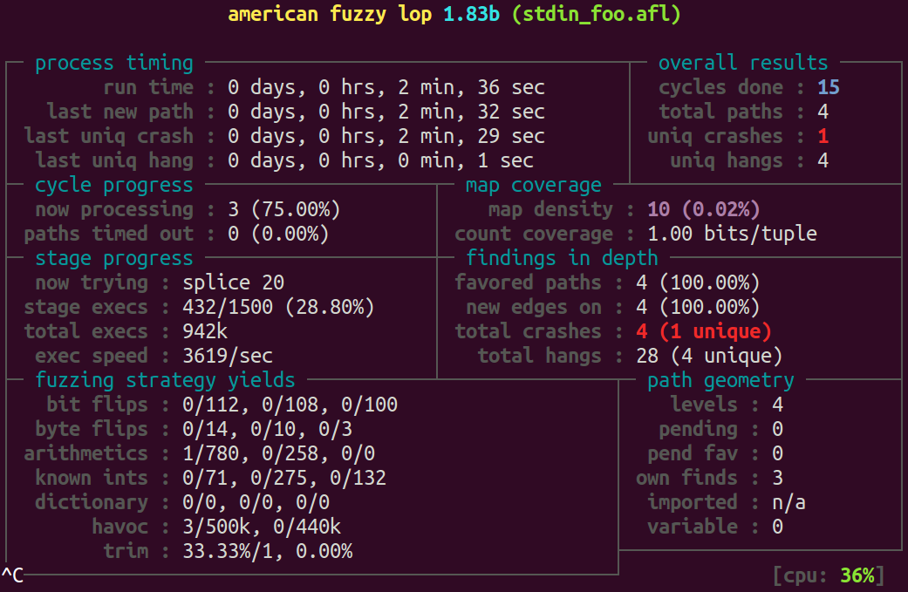
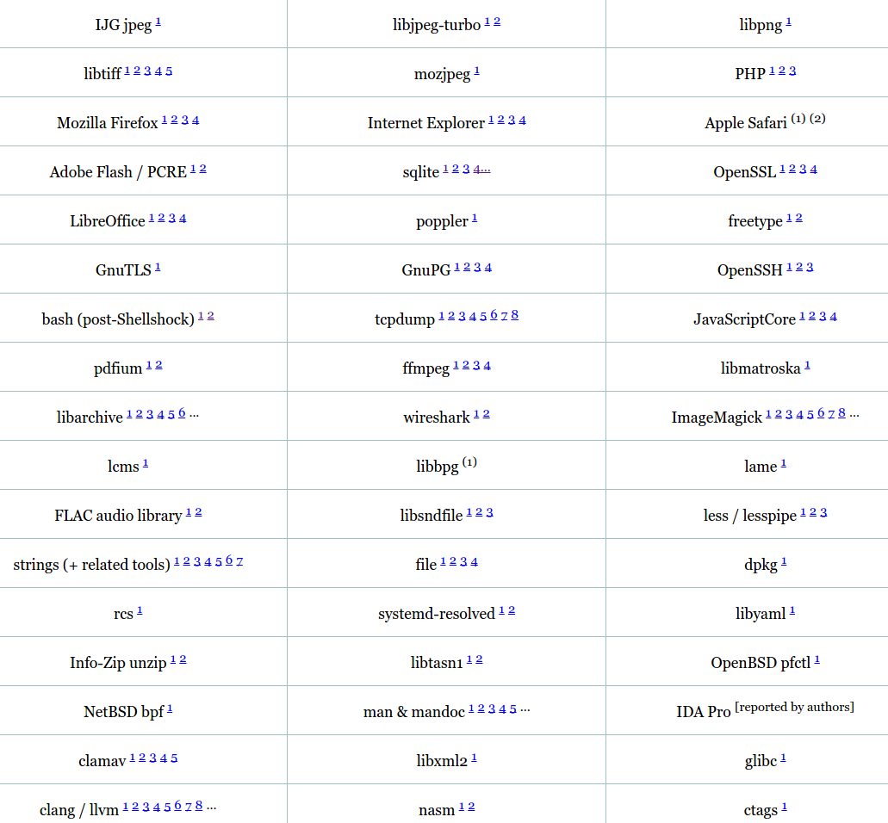
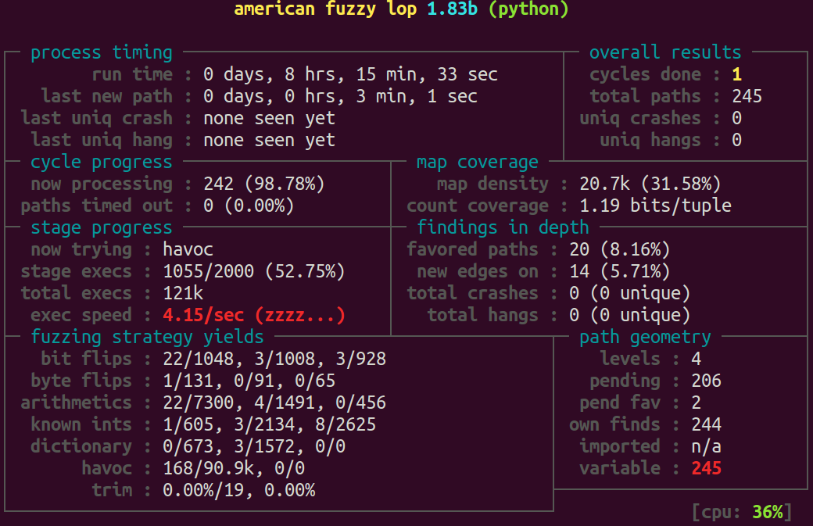

## Fuzz Testing

- firing data at a program
- attempting to crash it
    - unhandled errors
    - memory leaks

Note: - Moving on from *property based testing*
- More about crashes than checking properties

## Workflow

- leave running (for days or weeks)
- speed very important

Note: - needs to cover a lot of ground

---

## American fuzzy lop

- Michal Zalewski - 2014
- Written in C

Note: - bunny-the-fuzzer from 2007
- specialises in security and binary formats

## Types of Fuzz Testing

- traditional "brute-force"
- AFL: feedback guided fuzzing

## Traditional fuzzing isn't dead

- *FFmpeg and a thousand fixes*
    - input media samples
    - simple mutation algorithms
    - 500-2000 cores over 2 years
- src: [google online security blog](http://googleonlinesecurity.blogspot.co.uk/2014/01/ffmpeg-and-thousand-fixes.html)

Note: - video processing lib
- wide used (Chrome, MPlayer, VLC)
- feedbackless fuzzing, just mutating sample data
- but with enough resourses can make great progress...

## Types of bugs found

- Memory management bugs:
    - NULL pointer dereferences
    - Invalid pointer arithmetic
    - Out-of-bounds reads and writes
    - Use of uninitialized memory
- Division errors
- Assertion failures

*Our personal feeling is between 10% and 20% of the problems could be considered easily exploitable security issues*
<!-- -- class="fragment" -->

Note:- 100 to 200 zero-day exploits!

---

## AFL's goals

- Speed
- Reliability
- Simplicity (little setup required)
- Traditional fuzzing techniques: input mutation strategies
- Plus...

## AFL's secret

- compile-time instrumentation
- drop-in replacement for gcc or clang

<!-- . -->
    $ CC=/path/to/afl/afl-gcc ./configure
    $ make

Note: - maps out networks of code paths

---

## Toy example

Crash upon *foo!*

    char buf[100];
    read(0, buf, 100);

    if (buf[0] == 'f') {
      if (buf[1] == 'o') {
        if (buf[2] == 'o') {
          if (buf[3] == '!') {
            abort();
    }}}}

Note: - so the bug is that "foo!" crashes the program

## Manual test of fail

    # compile adding instrumentation
    $ afl-gcc -o stdin_foo.afl stdin_foo.c

    $ echo "foo!" | ./stdin_foo.afl
    one
    two
    three
    four
    Aborted

Note: - no configure or make, just compile

Let's try it:

    $ afl-fuzz -i testcase_dir -o findings_dir ./stdin_foo.afl

Note: - really basic example in testcase_dir "."
- stdin or filename
- use RAM disk if SSD

Running:

Note: - total paths / uniq crashes
- fuzzing strategy yields
- almost a million runs in 2.5 minutes

## Findings

`queue/`:
- `.`
- `fýç↡`
- `foý↡`
- `fooÿ`

`crashes/`:
- `foo!`

Note: numbered files

Filename:

    crashes/id:000000,sig:06,src:000003,op:arith8,pos:3,val:+34

- `sig:06`: SIGABRT (Abort signal)
- based on `queue/000003` (`fooÿ`)
- operation: 8-bit arithmetics
- position 3, value +34

## impressive trophy case of bug discoveries

Note: - that's only about a third of them!

---

<!-- http://lcamtuf.blogspot.co.uk/2015/04/finding-bugs-in-sqlite-easy-way.html -->
## Specific example: sqlite bugs found

Note: - sqlite is a very well testing and already fuzzed library

## Approach

- dictionary of SQL keywords
    - `ALTER, SELECT, COLUMN` etc
- grepped out sqlite hand-written test cases
- found 22 crashing test cases

<!-- . -->
    select(select strftime());

## How it works

- be a great traditional fuzzer
- search for inputs that span different code paths
- genetic algorithms for mashing examples together

---

## Fuzzing C Python

    # Download Python source
    $ hg clone https://hg.python.org/cpython

    # Build it with afl instrumentation
    $ CC=path/to/afl-clang ./configure --with-pydebug && make -j2

    # start fuzzing
    $ path/to/afl-fuzz -i in -o out ./python fuzz_json.py

<!-- . -->
    import ctypes
    import json
    import os
    import sys

    ctypes.CDLL(None).__afl_manual_init()

    try:
        json.load(sys.stdin)
    finally:
        os._exit(0)
<!-- -- class="fragment" -->

Note:- no bugs found as yet

---

## Python AFL

- Cython
- Connects instrumentation to Python interpreter
    - sys.settrace
- Converts unhandled exceptions to SIGUSR1

<!-- . -->
    py-afl-fuzz -i in -o out -- python pafl_fuzz.py

### Fuzzing signature decoding

    import sys

    import afl

    from cryptography.hazmat.primitives.asymmetric.utils import (
        decode_rfc6979_signature
    )

    afl.start()

    try:
        decode_rfc6979_signature(sys.stdin.read())
    except ValueError:
        pass