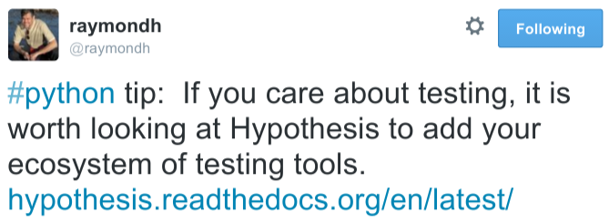

## Interesting questions raised

## Reproducibility /
## non-deterministic
- consistent pass or fail
<!-- -- class="fragment" -->
- find more bugs!
<!-- -- class="fragment" -->
- Find failing cases and add them to your deterministic test pack
<!-- -- class="fragment" -->

### Getting the balance right

Note: - purely random data is too naive, makes shallow progress
- enumerating all possibilities takes too long
- mutate example data just enough for novel outcomes

### Which to use?
- unittests should be fast but with adversarial data
<!-- -- class="fragment" -->
- use Hypothesis if your inputs are Python data structures
<!-- -- class="fragment" -->
- use (Python) AFL if your inputs are binary e.g. images
<!-- -- class="fragment" -->

## In Conclusion

We've seen two styles of coming up with test data today

- Humans are bad at picking random examples
<!-- -- class="fragment" -->
- Developers are bad at being adversarial
<!-- -- class="fragment" -->
- Computers are fast, let them play (break) your code
<!-- -- class="fragment" -->
- Find the bugs before your customer/secret service does
<!-- -- class="fragment" -->

## Let me end by saying

Note: - Don't interrogate your code like it's a fluffy bunny stuck up a tree...
- Fire a guided missile, try to blow branches off the tree and clear up the mess!
- Not just me saying it...

Note: - celeb endorsement

### I've been @tomviner

I hope you enjoyed the pizza.

## Any questions?
