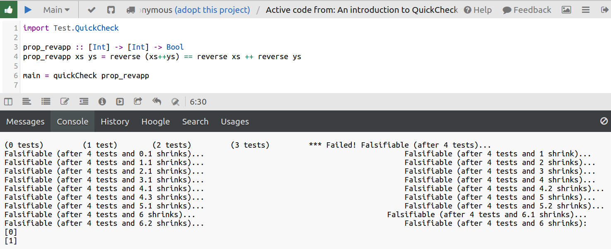
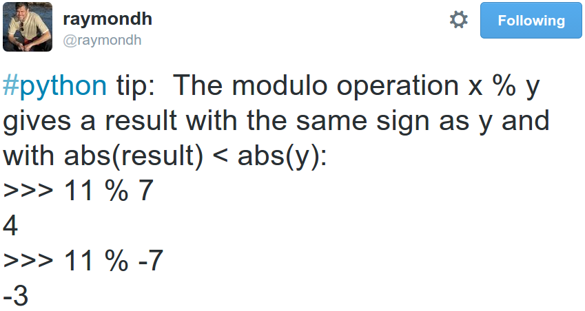
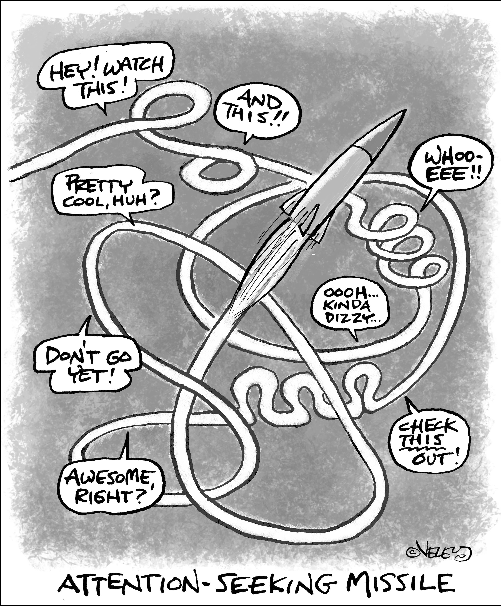

# QuickCheck

<!-- https://www.fpcomplete.com/user/pbv/an-introduction-to-quickcheck-testing -->
- Haskell
- From 1999
- Property based testing

Note: - (hands up, who's heard of ... ?)
- property based testing
- you specify a property of your code that must hold
- QuickCheck will "Quickly Check" if it can prove you wrong
- doing its best to find a counterexample


### QuickCheck quick example

    import Test.QuickCheck

    prop_revapp :: [Int] -> [Int] -> Bool
    prop_revapp xs ys = reverse (xs++ys) == reverse xs ++ reverse ys

    main = quickCheck prop_revapp



Note: - 4 integers / fingers
- arms snap off?
- this isn't actually a Haskell Lunch Conf, but incidentally


Functional programmers' artist's impression of imperative programmers:


([from *learn you a haskell*](http://learnyouahaskell.com/input-and-output))

Note: *In an imperative language, you have no guarantee that a simple function that should just crunch some numbers won't burn down your house, kidnap your dog and scratch your car with a potato while crunching those numbers*

---

# Hypothesis

Pythonic implementation and update of QuickCheck

By David R. MacIver

Note: Let's delve into the kidnapped dog world of Python


Let's rewrite this in Hypothesis:

    import Test.QuickCheck

    prop_revapp :: [Int] -> [Int] -> Bool
    prop_revapp xs ys = reverse (xs++ys) == reverse xs ++ reverse ys

    main = quickCheck prop_revapp


A Python list reverser:

    def reverse(ls):
        return list(reversed(ls))

Note: works on lists, so we can do `+` like the QuickCheck example


The property:

    from hypothesis import given
    import hypothesis.strategies as st

    @given(
        st.lists(st.integers()),
        st.lists(st.integers()),
    )
    def test_reverse(xs, ys):
        """
        join then reverse - v - reverse then join
        """
        assert reverse(xs + ys) == reverse(xs) + reverse(ys)

Note: - ok so let's run it
- using `py.test` as the runner


Result:
    >       assert reverse(xs + ys) == reverse(xs) + reverse(ys)
    E       assert [1, 0] == [0, 1]

    reverse_example.py:21: AssertionError
    -------- Hypothesis --------
    Falsifying example: test_reverse(xs=[0], ys=[1])

Note: - The proposition is False!
- Counter example to prove it
- And we didn't have to think up any example data, cool!


## So what's going on here?


## How could this be working?

- formal proof (symbolic execution / automated theorem prover)?
<!-- -- class="fragment" -->
    - nope (although that might be possible with libraries like `coq`)
    - https://www.adampalay.com/blog/2018/05/04/from-unit-testing-to-formal-proofs/
<!-- -- class="fragment" -->
- so that leaves us:
<!-- -- class="fragment" -->
    - trying a crud-ton of examples (aka fuzzing)
<!-- -- class="fragment" -->
    - wanna see what's going on under the covers?
<!-- -- class="fragment" -->

Note: - Alex posted
- I suspect machine driven Maths is coming - 0.5 == 1/2 from 1st principles


All input to our test function[:](https://gist.github.com/tomviner/2a37a5e5c9b7966390e1)

<iframe height=500 width=1000 src=https://cdn.rawgit.com/tomviner/2a37a5e5c9b7966390e1/raw/3d76f52673ebbb662b9fa9a396d0e33be7e987dd/output.txt>
    [206096504910900498493010377380239941762L, 27, 241, 468, 206096504910900498493010366855655511824L, -340, 206096504910900498493010370573292788646L, 6, -188, 206096504910900498493010365575630902925L]
    ...
    [0]
    [1]
    False

    -------- Hypothesis ---------
    Falsifying example: test_reverse(xs=[0], ys=[1])
    ========= 1 failed in 0.12 seconds ==========
</iframe>

Note: - Bro I heard you like integers
- big & small numbers
- slowly shrinking
- overshoots: hits examples that actually pass
- an example for the scrapbook: your usual testsuite


(an aside) Running again:

    [0]
    [1]
    False

    []
    [1]
    True

    [0]
    []
    True

    [0]
    [0]
    True

    [0]
    [1]
    False

    -------- Hypothesis ---------
    Falsifying example: test_reverse(xs=[0], ys=[1])
    ========= 1 failed in 0.11 seconds ==========

Note: - it's saved example data locally
- reproducible with `reproduce_failure ` decorator

---

Overview of what's happening:
1. generate "randomesque" input data
1. run test **repeatedly**
1. find counter example (or not)
1. *shrink* counter example


Is the data really random?

Where did all those integers come from?
<!-- -- class="fragment" -->


Hypothesis decorator:

    @given(
        st.lists(st.integers()),
        st.lists(st.integers()),
    )
    def test_reverse(xs, ys):


Hypothesis strategies:

    >>> import hypothesis.strategies as st
    >>> st.integers()
    RandomGeometricIntStrategy() | WideRangeIntStrategy()

<!-- . -->
    >>> st.lists(st.integers())
    ListStrategy(
        RandomGeometricIntStrategy() | WideRangeIntStrategy(),
        min_size=0, average_size=25.0, max_size=None
    )
<!-- -- class="fragment" -->

Note: strategies are relentlessly devious plans to break your program

---

Another example: raymainder



Note: - *raymainder*


Let's test it!

```python
from hypothesis import given, assume
import hypothesis.strategies as st

@given(st.integers(), st.integers())
def test_int_mod_properties(x, y):
    # can't divide by 0
    assume(y != 0)

    result = x % y
    # result with the same sign as y
    # and with abs(result) < abs(y)
    assert same_sign(result, y)
    assert abs(result) < abs(y)
```

<!-- . -->
    $ py.test test_modulo.py
    1 passed!
<!-- -- class="fragment" -->

Note: - 2 ints
- `assume` provides feedback to the random input, guiding it
- (next)
- I should know better than doubting Raymond Hettinger
- But I can and will Property Test his tweets!


## How does it do it?
- data strategies aka probability distributions
<!-- -- class="fragment" -->
- guided feedback via assume (and more)
<!-- -- class="fragment" -->
- shrinking of counterexamples
<!-- -- class="fragment" -->
- database of failing examples
<!-- -- class="fragment" -->

Note: - coverage now used
- internals are really interesting - [internals](https://github.com/HypothesisWorks/hypothesis/blob/master/guides/internals.rst)


Strategy internals:

```python
>>> import hypothesis.strategies as st

>>> st.integers()
RandomGeometricIntStrategy() | WideRangeIntStrategy()

>>> st.floats()
GaussianFloatStrategy() | BoundedFloatStrategy() |
ExponentialFloatStrategy() | JustIntFloats() |
FullRangeFloats() | NastyFloats()

>>> NastyFloats
0.0, inf, -inf, nan
sys.float_info.min, -sys.float_info.min,
sys.float_info.max, -sys.float_info.max
```


- from https://alexwlchan.net/talks/hypothesis-intro/


- from https://alexwlchan.net/talks/hypothesis-intro/


## Hypothesis in File Runner 3

- Postgres
<!-- -- class="fragment" -->
- Nameko
<!-- -- class="fragment" -->

Note: - Found Postgres hates null bytes
- Flakiness detection. Hypothesis seed bug


#### No nulls strategy

```
from hypothesis.searchstrategy.strings import OneCharStringStrategy
from hypothesis.strategies import text

def text_without_null_bytes():
    return text(
        alphabet=OneCharStringStrategy(min_codepoint=1)
    )
```


#### Using the strategy

```
@given(text_without_null_bytes(min_size=1))
def test_fuzzing_file_path(file_path):
    # test this file path doesn't break things, and is processed intact
    filerunner_upload(file_path)
```

Note: - swift ascii file paths
- tar headers real path


### Extras

- Packages
    - Timezones
<!-- -- class="fragment" -->
    - Datetimes
<!-- -- class="fragment" -->
- Hypothesis for the Scientific Stack
<!-- -- class="fragment" -->
    - numpy
<!-- -- class="fragment" -->
    - pandas
<!-- -- class="fragment" -->


## Advanced features

- Composite strategies
- Drawing interactively in tests
<!-- -- class="fragment" -->
- Stateful testing
<!-- -- class="fragment" -->
    - [How not to Die Hard with Hypothesis]()
<!-- -- class="fragment" -->

Note: - e.g. integer strategy as a length, composed with a custom list strategy
 - (next)
 - Decide at run time what data you need
 - (next)
 - Give hypothesis the controls
    - tries to find sequences of actions which cause a test failure
- then moving on




Note: - If there's time, let's look at another failure seeking missile that's getting a lot of attention
