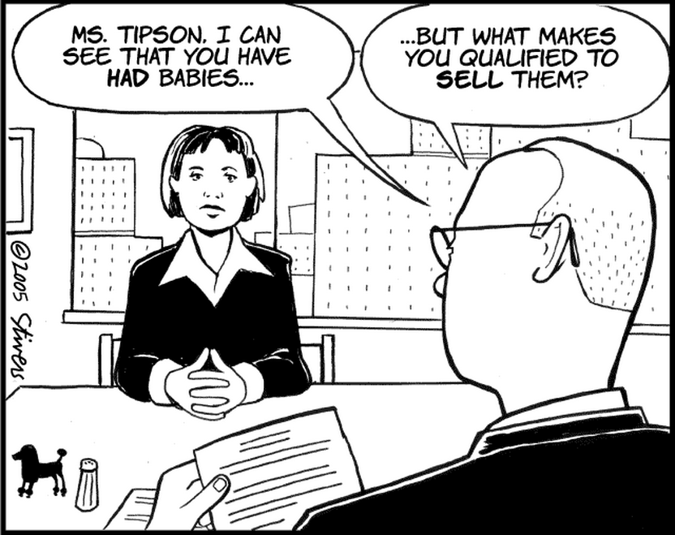
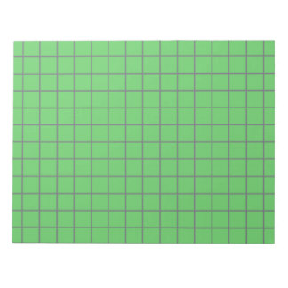

### Testing with two
### failure seeking missiles:
### fuzzing &
### property based testing

##### A EuroPython 2015 Talk by Tom Viner
##### @tomviner

---

I'm here to challenge how you test your code

Audience starting point?
- you've written tests...
- but always with hard coded example values?

Note: - who's only used hard coded values?
- who's used some form of random data

## I ask you:

### Are you testing your code hard enough?

Note: - stretching it?
- asking it questions it wasn't expecting?
- are you an aggressive interviewer?
- or are you a softball interviewer who asks easy questions?

Note: - ask the questions your code isn't expecting

So what we trying to achieve with our test input data?

## Possible goals of test input data

- cover happy path
- code coverage
- triggering unhandled exceptions
- path coverage
    - cyclomatic complexity
    - number linearly independent paths

Note: - absolute minimum
- code coverage: cover all validation fails & exception handling
- unhandled exceptions: bit worrying, we'd catch them if we knew
- path coverage: not just lines hit but path taken

## Input space

- Map of all possible inputs
- All input related bugs have a point on here

Note: - take a moment to think about your own testing
- which type of points do you pick when testing?
- where would an adversarial approach take you?

### Artist's impression of edge cases

Note: - reaching as many parts of input space as possible
- over testing simple cases
- under testing
    - ascii instead of unicode
    - empty list / strings
    - passing low positive integers, when large / negative / floats would find extra bugs

## So how to create test data?

- hand write hardcoded values
<!-- -- class="fragment" -->
- import random or model_mommy
<!-- -- class="fragment" -->
- OR... by firing a failure seeking missile???
<!-- -- class="fragment" -->

<!-- -- class="fragment" -->

Note: - hardcore
- let's take a closer look